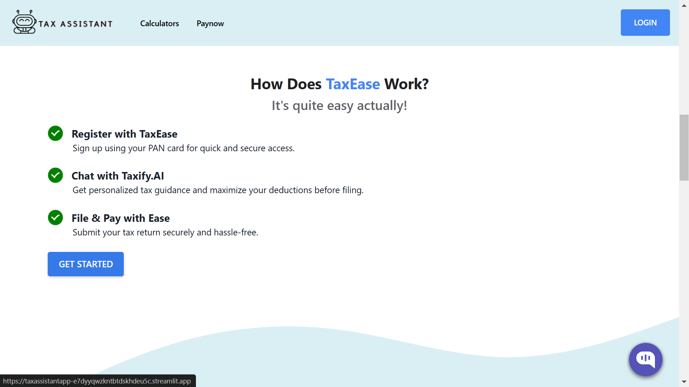
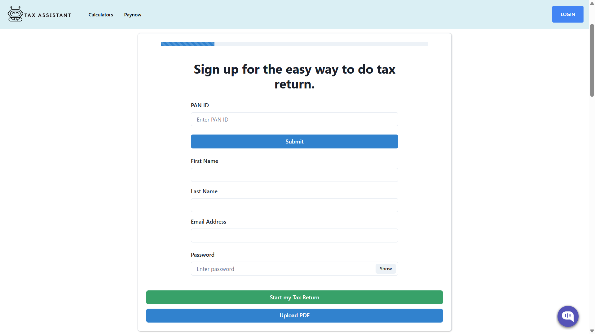
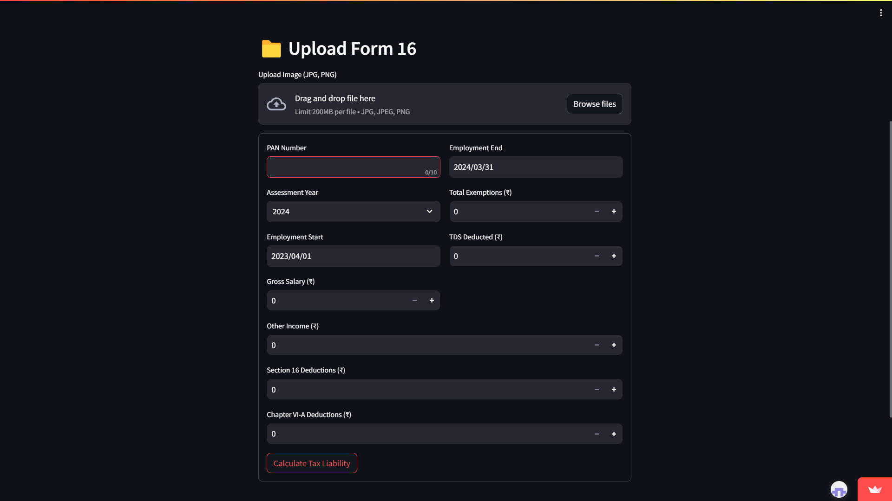
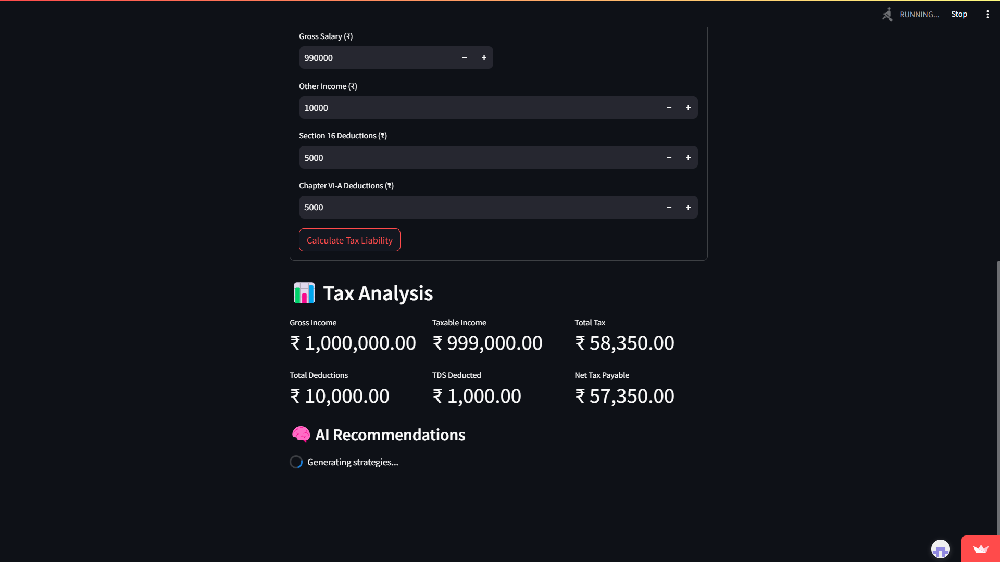

# TaxEase.Ai

TaxEase.Ai is an AI-powered tax management and filing solution designed to simplify the tax process for individuals and businesses. Leveraging advanced machine learning algorithms, TaxEase.Ai delivers intelligent tax calculations, personalized recommendations, and automated filing processes to optimize your tax experience.

## Overview

TaxEase.Ai streamlines tax management by:
- **Automating Tax Calculations:** Leverages AI to compute taxes accurately based on income, deductions, and credits.
- **Providing Intelligent Insights:** Uses predictive analytics to identify tax-saving opportunities and potential audit risks.
- **Simplifying Filing Processes:** Automates documentation, filing, and payment procedures for a seamless user experience.
- **Ensuring Data Security:** Implements robust security measures to protect sensitive financial data.

## How Does TaxEase Work?

It's quite easy actually! TaxEase simplifies the tax filing process into three simple steps:

### ✅ Register with TaxEase  
Sign up effortlessly using your **PAN card** for a secure and hassle-free experience.  
Our encrypted platform ensures your financial data stays protected while granting you seamless access to tax filing features.

### ✅ Chat with Taxify.AI  
Get **real-time, AI-powered tax guidance** tailored to your financial situation.  
Maximize your deductions, receive tax-saving tips, and clarify tax-related queries before filing—all with the help of **Taxify.AI**, your intelligent tax assistant.

### ✅ File & Pay with Ease  
Submit your tax return **securely and accurately** with just a few clicks.  
Our system auto-verifies details, minimizes errors, and ensures **compliance with Indian tax regulations**, making tax filing stress-free and efficient.



## Features

- **AI-Powered Tax Recommendations**
  - Uses machine learning models to analyze financial data.
  - Provides personalized recommendations for maximizing tax deductions.

- **PAN Card Authentication**
  - The PAN Card Authentication feature streamlines the registration process while ensuring robust security and compliance. 
  - By leveraging a government-issued identifier, this feature significantly reduces fraud and simplifies user onboarding.


- **Multi-Platform Access**
  - Automatically syncs your tax data in real time across all devices.
  - Provides a responsive interface that adapts to various screen sizes and resolutions.


- **Quick & Easy Filing**
  - The system processes user-provided financial data (such as income, expenses, and deductions) and automatically computes tax liabilities, eligible deductions, and potential refunds.


- **Maximize your refund, Minimize Tax liability**
  - Provides you with an estimated refund amount that reflects maximum possible savings.
  - It automatically identifies all eligible tax deductions and credits based on the latest tax regulations.
   

## Tech Stack

- **Backend:**
  - [Node.js](https://nodejs.org/) with Express.js for RESTful API development.
  - **AI Modules:** Python (using libraries such as TensorFlow, PyTorch, or scikit-learn) for implementing machine learning models.
- **Frontend:**
  - [React](https://reactjs.org/) for a responsive and dynamic user interface.
  - CSS frameworks like [Bootstrap](https://getbootstrap.com/) or [Tailwind CSS](https://tailwindcss.com/) for styling.
- **Deployment:**
  - Used Vercel and Streamlit for containerized deployment.
  - Utilized GitHub for version control and collaboration.
- **Additional Tools:**
  - OCR Integration for document processing.

## Installation and Setup

### Prerequisites

- [Node.js](https://nodejs.org/) and npm/yarn installed
- [Python](https://www.python.org/) for AI module dependencies

### Steps

1. **Clone the Repository:**
   ```bash
   git clone https://github.com/KeerthiSaiPG/TaxEase.Ai.git
   cd TaxEase.Ai
   ```
2. **Install Dependencies:**
   ```bash
   npm install  # For frontend dependencies
   pip install -r requirements.txt  # For AI module dependencies
   ```
3. **Run the Application:**
   ```bash
   npm start 
   python main.py
   ```
## Contributions

We welcome contributions from the community to improve and expand TaxEase.Ai!

Happy coding! 🚀

## **Remarks**

### Tax Calculation Web App

#### Overview

This was a part of our whole project. The first part was about PAN authentication and login, and the second part was tax calculation with AI suggestions. This is a React-based web application integrated with a backend for automated tax filing using OCR and AI-based tax recommendations. The project was developed using Meta-Llama-3.1-8B-Instruct-Turbo-128K and Streamlit for efficient tax calculations.

#### Known Issue

Despite our best efforts and extensive debugging, the tax calculation page linked to our React app is currently facing dependency issues and conflicts.

**Note:** The application functioned correctly even after submission of our project. However, due to an update in the version of one of our dependencies, these conflicts arose, and clicking on the following buttons does not open the respective pages:

- Get Started
- Salary Tax
- Upload PDF

To work around this issue, follow the steps below to run the application locally.

### Installation & Setup (Running Locally)

#### Prerequisites

Ensure that you have the following installed on your system:

- **Node.js & npm** (For React frontend)
- **Python 3** (For backend services)
- **Streamlit**

### GitHub Repository

[TaxEase App Repository](https://github.com/KeerthiSaiPG/TaxEase_app)

```This is link for the other part of the project```


